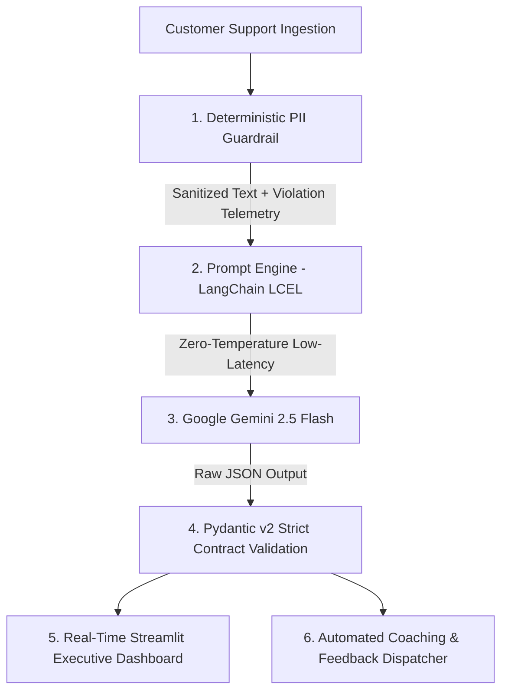

# 🛡️ QualityOps AI — Enterprise Compliance & SRE Audit Platform

[](https://github.com/jraphaelbarbosa/QualityOps-AI-Agent)


> **[ 🇧🇷 Leia em Português ](README.pt-br.md)**

> **Executive Overview:** QualityOps is a production-grade GenAI compliance auditing and Site Reliability Engineering (SRE) agent designed to automate quality assurance across 100% of customer support interactions. Built with deterministic pre-LLM PII guardrails, LangChain LCEL orchestration, and strict Pydantic v2 data contracts.

---

## 🏗️ 1. Platform Architecture & Data Flow



---

## 🛡️ 2. Enterprise Platform, Evals & Guardrails Standards

Designed following modern **GenAI Platform & LLMOps** requirements:

### 🔒 Deterministic Pre-LLM Guardrails (PII Protection)
* **Zero Trust Data Ingestion:** RegEx-based and heuristic pattern matchers intercept and mask Brazilian CPFs, credit card numbers, emails, and phone numbers before payloads reach external LLM endpoints.
* **Compliance Assurance:** Guarantees strict adherence to **LGPD**, **GDPR**, and **PCI-DSS** protocols.

### 📐 Strict Data Contracts (Pydantic v2)
* Eliminates unvalidated dictionaries. All inputs and outputs conform strictly to `AuditRequest` and `AuditReport` models with automated type enforcement and score bounds (`0 <= score <= 100`).

### ⚡ Low Latency & Cost Optimization
* Leverages **Gemini 2.5 Flash** at temperature `0.0` with LangChain Expression Language (LCEL) for sub-2-second deterministic audit evaluations and minimal token overhead.

### 🧪 Automated Testing & CI Quality Gate
* Complete unit test suite (`pytest`) featuring deterministic mocks for API calls (0 token cost during CI).
* GitHub Actions automated quality pipeline executing linting (`ruff`) and test coverage verification on every commit.

---

## 📂 3. Repository Canonical Structure

```text
QualityOps-AI-Agent/
├── .github/
│   └── workflows/
│       └── ci.yml                     # Automated CI Quality Gate
├── src/
│   ├── models/
│   │   └── schemas.py                 # Pydantic v2 Strict Data Contracts
│   ├── guardrails/
│   │   └── pii_sanitizer.py           # Deterministic PII Interceptor
│   ├── langchain_backend.py           # LCEL Audit Pipeline & Gemini Engine
│   ├── app.py                         # Streamlit Executive Dashboard
│   └── main.py                        # Service Entrypoint
├── tests/
│   ├── conftest.py                    # Pytest Global Fixtures & LLM Mocks
│   └── unit/
│       ├── test_guardrails.py         # PII Masking & Security Tests
│       └── test_audit_engine.py       # Pydantic Contracts & Audit Tests
├── requirements.txt                   # Production Dependencies
└── README.md                          # Platform Technical Documentation
```

---

## 🚀 4. Quickstart & Local Execution

### Prerequisites
* Python 3.10+
* Google Gemini API Key

### Setup Environment
```bash
# 1. Clone repository
git clone https://github.com/jraphaelbarbosa/QualityOps-AI-Agent.git
cd QualityOps-AI-Agent

# 2. Setup virtual environment
python -m venv venv
source venv/bin/activate  # On Windows: venv\Scripts\activate

# 3. Install dependencies
pip install -r requirements.txt
pip install pytest pytest-cov ruff
```

### Configure Credentials
Copy `.env.example` to `.env` and add your API key:
```bash
cp .env.example .env
# Edit .env and set GEMINI_API_KEY=your_key_here
```

### Run Unit Tests & CI Gate Locally
```bash
# Run tests with coverage
pytest --cov=src tests/

# Run linter
ruff check .
```

### Launch Streamlit Dashboard
```bash
streamlit run src/app.py
```
