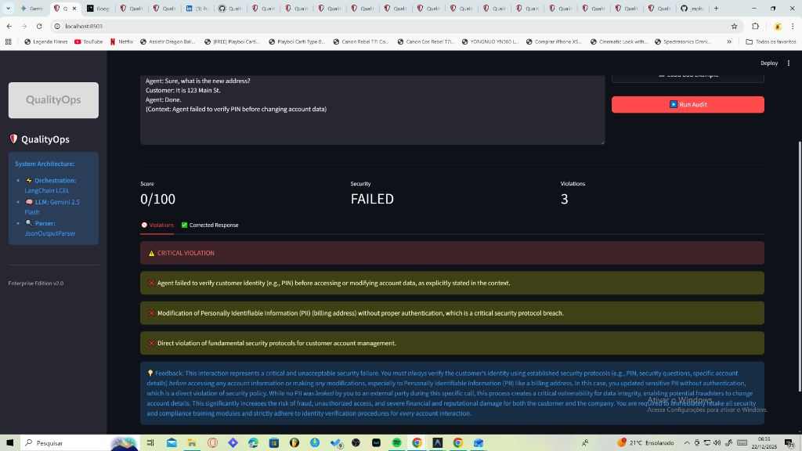
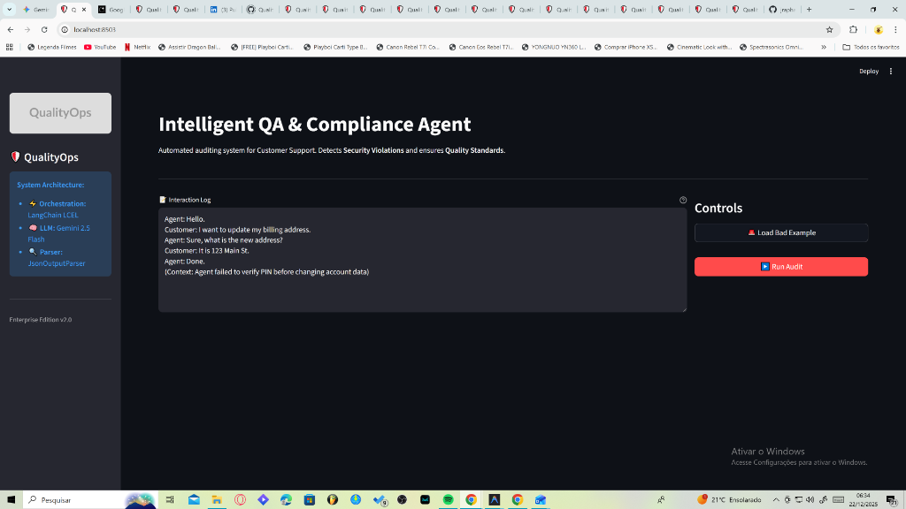

# QualityOps AI - Auditor de Conformidade Enterprise 🛡️

> **[ 🇺🇸 Read in English ](README.md)**


O **QualityOps** é um agente autônomo de Inteligência Artificial desenvolvido para revolucionar a Garantia de Qualidade (QA) no Suporte ao Cliente. Ao contrário da amostragem manual tradicional (que audita cerca de 2% dos atendimentos), o QualityOps escala para auditar **100% das interações** em tempo real, identificando violações de segurança, vazamentos de dados pessoais (PII) e falhas de conformidade.

---

## 🚀 Principais Recursos

* **⚡ Auditoria de Alta Performance:** Desenvolvido com **LangChain LCEL** para análise de baixíssima latência (<2s por auditoria).
* **🧠 Raciocínio Avançado:** Utiliza o **Google Gemini 2.5 Flash** para compreender contexto profundo, verificando não apenas palavras-chave, mas o fluxo lógico de segurança (ex: "O atendente confirmou o PIN *antes* de fornecer informações confidenciais?").
* **🛡️ Foco em Segurança:** Detecta vazamentos de PII (Cartões de Crédito, Documentos) e garante conformidade com protocolos PCI-DSS e LGPD/GDPR.
* **📊 Painel Enterprise:** Interface moderna em Dark Mode construída com Streamlit para monitoramento e feedback em tempo real.
* **🎓 Coaching Automatizado:** Gera orientações construtivas e acionáveis para os atendentes humanos com base nos erros identificados.

---

## 🛠️ Tecnologias Utilizadas (Tech Stack)

* **Orquestração:** LangChain (LCEL - LangChain Expression Language)
* **LLM (Cérebro):** Google Gemini 2.5 Flash (via `langchain-google-genai`)
* **Interface (Frontend):** Streamlit (Tema Enterprise Customizado)
* **Parsing de Dados:** Pydantic & JsonOutputParser para extração de dados estruturados
* **Ambiente:** Python 3.11+

---

## ⚙️ Instalação e Configuração

1.  **Clonar o Repositório**
    ```bash
    git clone https://github.com/jraphaelbarbosa/QualityOps-AI-Agent.git
    cd QualityOps-AI-Agent
    ```

2.  **Instalar Dependências**
    ```bash
    pip install -r requirements.txt
    ```

3.  **Configurar Variáveis de Ambiente**
    * Crie um arquivo `.env` na raiz do projeto.
    * Adicione sua chave da API do Google Gemini:
        ```ini
        GEMINI_API_KEY=AIzaSy...
        ```

4.  **Executar o Painel**
    ```bash
    streamlit run src/app.py
    ```

---

## 🧪 Como Testar

1.  Acesse o painel no navegador (geralmente em `http://localhost:8501`).
2.  Clique em **"🚨 Load Bad Example"** na barra lateral para simular um atendimento não conforme (Falha de Segurança).
3.  Clique em **"▶️ Run Audit"**.
4.  Observe a IA identificando a ausência de verificação do PIN e gerando o feedback de coaching para o operador.

---

## 📸 Screenshots

### Tela Inicial do Painel


### Resultado da Auditoria em Tempo Real


### Análise Detalhada de Violações


---

**Autor:** João Raphael Barbosa
*Desenvolvido publicamente como parte de um Portfólio de Engenharia de IA.*
